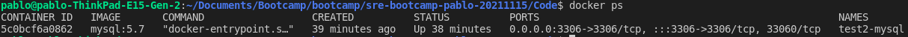
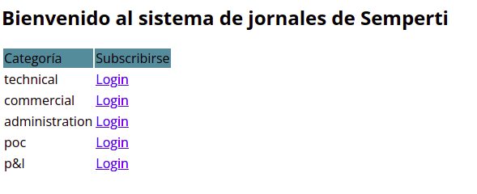
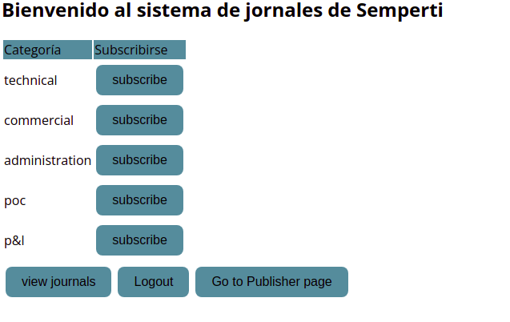

# Week 01 - Assignments
Repositorio para los assignments de la primer semana.

# Java Application

## Prerequisites

	1. Java 8
	2. Maven 3.3+
	3. MySQL 5.6+
	4. Internet connection
	5. Docker
	
	
## Instrucciones para correr esta aplicación

	1. Levantar un contenedor de mysql y exponer el puerto 3306 con el siguiente comando
	- docker run --name test2-mysql -e MYSQL_ROOT_PASSWORD=mysqlpass -d -p 3306:3306  mysql:5.7
	2. chequear que el contenedor este corriendo y expuesto el puerto 3306 con el comando "docker ps"

	3. Configurar la conexión de la base de datos desde Code/src/main/resources/application.properties con el user y la pass de la db
	4. Por defecto, la aplicación almacena los PDFs en el directorio <User_home>/upload. asi que deberias correr el comando "cp -r PDFs/* /<User_home>/upload/ Esto para que la aplicacion pueda encontrar los PDF previamente cargados
	5. Ubicate en la carpeta del código y ejecutá "mvn spring-boot:run".
	6. Revisá la siguiente dirección http://localhost:8080, deberias ver lo siguiente

	7. Una ves logeado usando las credenciales que se detallan mas abajo ya podras cargar journals o ver los cargados anteriormente

	
	
## Datos de autenticación

	El sistema viene con 4 cuentas pre-definidas:
		1. publishers:
			- username: publisher1 / password: publisher1
			- username: publisher2 / password: publisher2
		2. public users:
			- username: user1 / password: user1
			- username: user2 / password: user2
            
# Contact

Cualquier duda o consulta, ubicanos en [Slack](https://semperti.slack.com).
