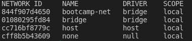
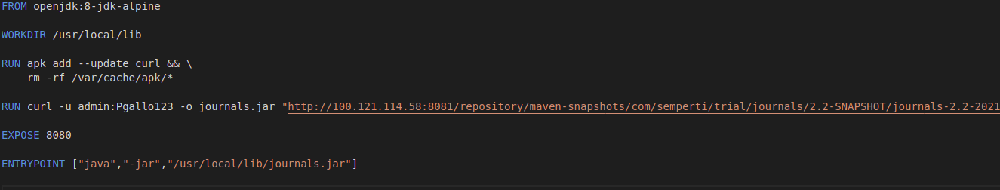
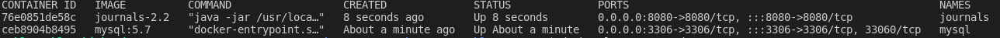
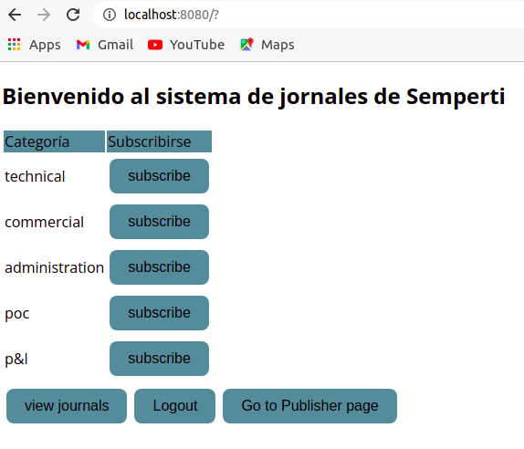

# Week 01 - Assignments
Repositorio para los assignments de la primer semana.

# Java Application

## Prerequisites

	1. Docker
	2. Internet connection
	
	
## Instrucciones para correr esta aplicación

	1. Para que la aplicacion funcione como es debido necesitamos una base de datos MySQL corriendo para que la aplicacion java pueda conectarse y funcionar correctamente, para esto decidimos utilizar otro contenedor con MySQL. Para que sea mas facil de configurar, el primer paso seria crear una red de docker con el siguiente comando "docker network create --driver bridge bootcamp-net", constatamos que la red haya sido creada exitosamente "docker network ls"

	
	2. corremos un contenedor de docker MySQL attacheado a la red creada recientemente "docker run --name mysql -e MYSQL_ROOT_PASSWORD=mysqlpass -d -p 3306:3306 --network bootcamp-net mysql:5.7". Con esto ya tenemos nuestra red de contenedores creada con una base de datos corriendo tal y como lo necesitamos. 
	
	3. El siguiente paso es crear una Dockerfile para generar la imagen de nuestra aplicacion que sera desplegada posteriormente.

	
	4. Ahora corremos la imagen creada en el punto anterior, tambien atacheada a la network donde tenemos MySQL "docker run --name journals -d -p 8080:8080 --network bootcamp-net journals-2.2". Comprobamos que ambos contenedores esten corriendo.

	
	5. Si hemos seguido los pasos al pie de la letra entonces ingresando a localhost:8080 deberiamos poder logearnos a la aplicacion y empezar a utilizarla

	
## Datos de autenticación

	El sistema viene con 4 cuentas pre-definidas:
		1. publishers:
			- username: publisher1 / password: publisher1
			- username: publisher2 / password: publisher2
		2. public users:
			- username: user1 / password: user1
			- username: user2 / password: user2
            
# Contact

Cualquier duda o consulta, ubicanos en [Slack](https://semperti.slack.com).
