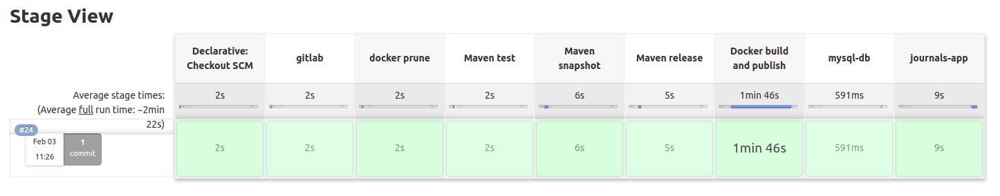

# Week 01 - Assignments
Repositorio para los assignments de la primer semana.

# Java Application

## Prerequisites

	1. Java 8
	2. Maven 3.3+
	3. MySQL 5.6+
	4. Internet connection
	5. Jenkins
	6. Git
	7. Red de docker con el nombre bootcamp

## GITOPS

	1. Lo primero que debemos hacer para utilizar un manifiesto de gitops es importar los archivos necesarios, el Dockerfile, el pom.xml, el settings.xml y el application.properties que contienen los cambios necesarios para que la aplicación corra sin fallos en nuestros ambientes.
	2. como punto siguiente creamos un Jenkinsfile que contenga todos los pasos realizados en las etapad de CI/CD y lo modificamos para que adquiera las variables como por ejemplo la version desde el archivo manifest que vamos a crear.
	3. Ahora tenemos que crear un .yaml con el nombre que deseemos, en este caso utilice manifest.yaml, en el archivo manifest podemos listar todas las variables que necesitemos como los ambientes, versiones, urls, etc..
	4. Ahora debemos ir a jenkins y crear nuestro job de gitops al igual que lo hicimos en los pasos de CI/CD, para que se revise el repo y la rama cada 5 minutos y se genere el build del job si hay algun cambio.
	5. Una ves tengamos todo lo necesario pusheamos el repo y esperamos que jenkins realice el job de manera automatica, si todos los pasos fueron satisfactorios veremos lo siguiente en jenkins.

	
	
## Instrucciones para correr esta aplicación

	1. Configurar la conexión de la base de datos desde Code/src/main/resources/application.properties
	2. Ubicate en la carpeta del código y ejecutá "mvn spring-boot:run".
	3. Revisá la siguiente dirección http://localhost:8080
	4. [Opcional] Por defecto, la aplicación almacena los PDFs en el directorio <User_home>/upload. Si querés cambiar este directorio, podés utilizar la propiedad -Dupload-dir=<path>.
	5. [Opcional] Los PDFs predefinidos pueden encontrarse en la carpeta PDF. Si querés ver los PDFs, tenés que copiar los contenidos de esta carpeta a lo definido en el paso anterior.
	
## Datos de autenticación

	El sistema viene con 4 cuentas pre-definidas:
		1. publishers:
			- username: publisher1 / password: publisher1
			- username: publisher2 / password: publisher2
		2. public users:
			- username: user1 / password: user1
			- username: user2 / password: user2
            
# Contact

Cualquier duda o consulta, ubicanos en [Slack](https://semperti.slack.com).
