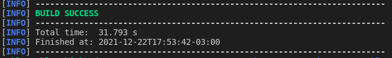

# Week 01 - Assignments
Repositorio para el assignment "cargar aplicacion java en nexus repository".

# Java Application

## Prerequisites

	1. Java 8
	2. Maven 3.3+
	3. MySQL 5.6+
	4. Internet connection
	5. maven

	
## Instrucciones para correr esta aplicación

	1. Con la aplicacion funcionando desde el paso anterior, procedemos a crear el playbook para que nexus repository sea instalado en la vm e iniciamos con el comando "ansible-playbook nexus.yml --ask-vault-password"
	2. Una ves instalado nexus repository, hacemos cat "usr/local/sonatype-work/nexus3/admin.password" y copiamos la contraseña de nexus, mas adelante en los pipelines ci/cd vamos a tomar esta variable de manera automatica.
	3. creamos el archivo settings.xml e introducimos usuario y password por cada servidor de repositorio.
	4. modificamos el archivo pom.xml para introducir los datos del repositorio nexus que vamos a usar para desplegar los releases y snapshots.
	5. ya con esto podemos pararnos en la carpeta Code y ejecutar los comandos que desplegaran el release y el snapshot
	SNAPSHOT: "mvn versions:set -DnewVersion=2.1-SNAPSHOT" si colocamos el -SNAPSHOT al final de la version, maven automaticamente sabe que debe ser desplegado en el repositorio de snapshot. y luego el comando "mvn clean deploy --settings {settings-path}/settings.xml" siendo settings-path la ruta donde estara settings.xml anteriormente creado.
	RELEASE: "mvn versions:set -DnewVersion=2.0" y luego el comando "mvn clean deploy --settings {settings-path}/settings.xml" siendo settings-path la ruta donde estara settings.xml anteriormente creado. Si fue correctamente desplegado veremos este output
 

## Datos de autenticación

	El sistema viene con 4 cuentas pre-definidas:
		1. publishers:
			- username: publisher1 / password: publisher1
			- username: publisher2 / password: publisher2
		2. public users:
			- username: user1 / password: user1
			- username: user2 / password: user2
            
# Contact

Cualquier duda o consulta, ubicanos en [Slack](https://semperti.slack.com).
