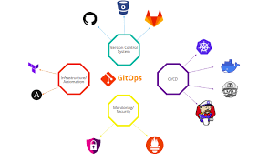

# Week 01 - Assignments
Repositorio para los assignments de la primer semana.

# Java Application

## Prerequisites

	1. Java 8
	2. Maven 3.3+
	3. MySQL 5.6+
	4. Internet connection
	5. Jenkins
	6. Git
	7. Red de docker con el nombre bootcamp

## GITOPS

	1. Gitops como cultura de trabajo, en la que priman ciertos principios que son intrinsecos a a la cultura misma. 
	- Debe haber una fuente unica de verdad "source of truth" con el estado deseado del sistema versionado e inmutable en un repositorio git
	- El sistema por completo tiene que estar descrito de forma declarativa 
	- Automatizado, los cambios que sean aprobados en el repositorio deben ser desplegados de forma automatica a traves de pipelines y herramientas de CI/CD 
	- El entorno de ejecución debe estar bajo control constante, reconciliación continua, es quizas el principio mas importante y el mas dificil de aplicar 

## Trabajo realizado

	1. Trate de buscar una forma de implementar gitops en este projecto aplicando los principios antes mencionados, algunos con mayor exito que otros
	2. en todas las ramas del proyecto esta el codigo de manera declarativa, es decir, si vamos rama por rama ejecutando el codigo con las herramientas adecuadas, vamos a llegar siempre al mismo estado que se ah logrado ahora con la aplicación. Con esto logramos que todo este escrito de manera declarativa y utilizamos jenkins como herramienta de ci, tambien incluimos un versionado para poder tener control del sistema, y su estado esta versionado y es ininmutable en un solo repositorio de git, tratando asi de incluir estos 4 principios dentro de nuestro proyecto.
	
	
## Instrucciones para correr esta aplicación

	1. Configurar la conexión de la base de datos desde Code/src/main/resources/application.properties
	2. Ubicate en la carpeta del código y ejecutá "mvn spring-boot:run".
	3. Revisá la siguiente dirección http://localhost:8080
	4. [Opcional] Por defecto, la aplicación almacena los PDFs en el directorio <User_home>/upload. Si querés cambiar este directorio, podés utilizar la propiedad -Dupload-dir=<path>.
	5. [Opcional] Los PDFs predefinidos pueden encontrarse en la carpeta PDF. Si querés ver los PDFs, tenés que copiar los contenidos de esta carpeta a lo definido en el paso anterior.
	
## Datos de autenticación

	El sistema viene con 4 cuentas pre-definidas:
		1. publishers:
			- username: publisher1 / password: publisher1
			- username: publisher2 / password: publisher2
		2. public users:
			- username: user1 / password: user1
			- username: user2 / password: user2
            
# Contact

Cualquier duda o consulta, ubicanos en [Slack](https://semperti.slack.com).
