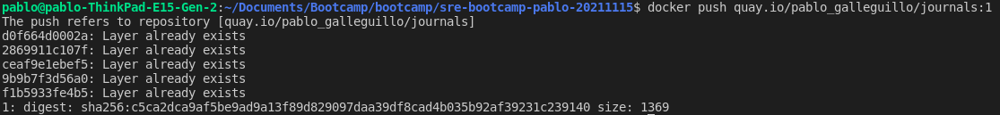
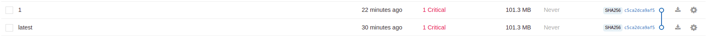

# Week 05 - Assignments
Repositorio para los assignments de la quinta semana.

# Docker image store

## Prerequisites

	1. docker
	2. Internet connection
	
	
## Instrucciones para subir una imagen a un repo de docker

	1. Ingresar a quay.io y logearse utilizando mis credenciales, una ves dentro voy a repositories, create new repository


	2. Le damos al repositorio el nombre que nosotros queramos, en este caso journals, el nombre real del repo queda compuesto de la siguiente manera [user/repo] pablo_galleguillo/journals

	3. Ahora vamos a tagear la imagen con el nombre del repo y colocamos tag al final, seria asi en este caso 'quay.io/pablo_galleguillo/journals:1.0.0'
```
docker tag journals-2.2 quay.io/pablo_galleguillo/journals:1.0.0
```

	4. pusheamos la imagen al repo

```
docker push quay.io/pablo_galleguillo/journals:1
```

	5. Podemos contorlar que este subida correctamente en quay.io, en este caso subi dos, una sin tag y la otra con el tag "1"

	