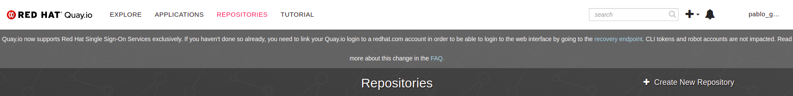

# Week 01 - Assignments
Repositorio para los assignments de la primer semana.

# Java Application

## Prerequisites

	1. docker
	2. Crear una red de docker en el host con el nombre bootcamp
```
docker network create bootcamp
```
## Instrucciones para correr esta aplicación

	1. Creamos la Jenkinsfile correspondiente para que cree una base de datos mysql en el host attacheada a la red de docker creada anteriormente
	2. Ahora levantamos un contenedor de la aplicación journals en la misma red que la bd del punto anterior para que pueda conectarse.


	3. Podemos verificar que la app se encuentra funcionando en la siguiente ruta http://100.109.4.7:8083/

curl --silent --location http://pkg.jenkins-ci.org/redhat-stable/jenkins.repo | sudo tee /etc/yum.repos.d/jenkins.repo
sudo rpm --import https://jenkins-ci.org/redhat/jenkins-ci.org.key
sudo yum install jenkins 

	
## Datos de autenticación

	El sistema viene con 4 cuentas pre-definidas:
		1. publishers:
			- username: publisher1 / password: publisher1
			- username: publisher2 / password: publisher2
		2. public users:
			- username: user1 / password: user1
			- username: user2 / password: user2
            
# Contact

Cualquier duda o consulta, ubicanos en [Slack](https://semperti.slack.com).
