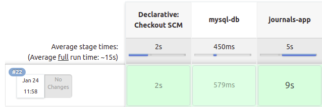
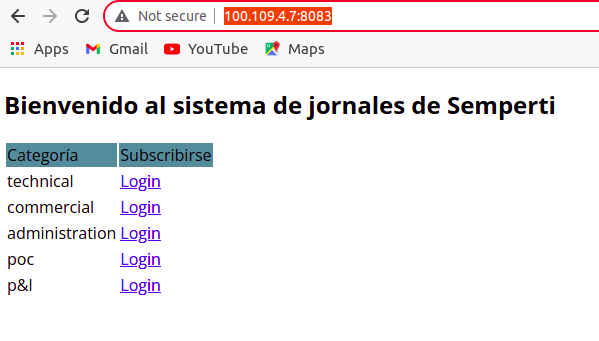

# Week 01 - Assignments
Repositorio para los assignments de la primer semana.

# Java Application

## Prerequisites

	1. docker
	2. Crear una red de docker en el host con el nombre bootcamp
```
docker network create bootcamp
```
## Instrucciones para correr esta aplicación

	1. Creamos la Jenkinsfile correspondiente para que cree una base de datos mysql en el host attacheada a la red de docker creada anteriormente
	2. Ahora levantamos un contenedor de la aplicación journals en la misma red que la bd del punto anterior para que pueda conectarse.

	
	3. Podemos verificar que la app se encuentra funcionando en la siguiente ruta http://100.109.4.7:8083/


## Problemas encontrados

	En lo personal el problema que tuve mas importante fue abandonar una alternativa de solución demasiado rapido, al cambiar el hostname en el aplication properties de la app y crear la red de docker para que los contenedores pudieran conectarse, iba por buen camino hacia una solución, al no funcionar y pensar que mi conocimiento bastaba, abandone la opción para buscar otra alternativa porque pense que mi conocimiento del tema era absoluto, en realidad solo me falto mirar un poco mas de la documentación, porque le estaba poniendo el nombre al contenedor, pero no el hostname que yo queria, subestime la solución y sobreestime mi conocimiento, con esto entendi mas como funciona el networking de docker, me tomo mucho tiempo pero el aprendizaje fue bueno de igual manera
	
## Datos de autenticación

	El sistema viene con 4 cuentas pre-definidas:
		1. publishers:
			- username: publisher1 / password: publisher1
			- username: publisher2 / password: publisher2
		2. public users:
			- username: user1 / password: user1
			- username: user2 / password: user2
            
# Contact

Cualquier duda o consulta, ubicanos en [Slack](https://semperti.slack.com).
