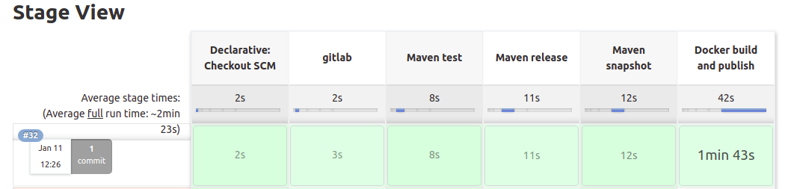

# Jenkins-ci - Assignment

# Java Application

## Prerequisites

	1. Java 8
	2. Maven 3.3+
	3. MySQL 5.6+
	4. Internet connection
	5. Jenkins
	6. Git

## Instructivo

	1. vamos a nuestro jenkins y creamos una nueva folder con el nombre bc-pgalleguillo, dentro de esta carpeta crearemos un job con el nombre journals-ci

	2. le damos a configure y llenamos los datos del repo y configuramos el build trigger, el repositorio y demas, notese que debe crear credenciales con el acceso a gitlab usando su nombre de usuario y contraseña para que jenkins pueda acceder al repositorio.

	3. Vamos a nuestro repositorio de gitlab para configurar un acces token, esto se hace en editar perfil, acces tokens. En esta sección creamos un token con api scope y guardamos el token, lo vamos a usar mas tarde.

	4. Instalamos el plugin gitlab plugin y lo configuramos en manage jenkins, configure systems. aqui tenemos que crear una credencial del token que acabamos de hacer en gitlab, y configuramos asi

 
	5. confeccionamos el jenkinsfile y lo metemos dentro del repo, junto con el archivo Dockerfile

	6. Con las configuraciones que creamos dentro del job de jenkins, cada ves que un cambio sea pusheado a la rama en cuestion, un build del job se va a ejecutar automaticamente para subir los artefactos a nuestro repo de nexus, tambien por ultimo buildeara la imagen de docker con el .jar recien creado. Si el job se ejecuto satisfactoriamente deberas ver algo asi en el proyecto

## Versionado

	Para versionar el proyecto utilizamos la variable BUILD_NUMBER de jenkins que versionara tanto los builds de maven como la imagen de docker con el numero de build ejecutado, para versionar todo de manera automatica
	
	
## Instrucciones para correr esta aplicación

	1. Configurar la conexión de la base de datos desde Code/src/main/resources/application.properties
	2. Ubicate en la carpeta del código y ejecutá "mvn spring-boot:run".
	3. Revisá la siguiente dirección http://localhost:8080
	4. [Opcional] Por defecto, la aplicación almacena los PDFs en el directorio <User_home>/upload. Si querés cambiar este directorio, podés utilizar la propiedad -Dupload-dir=<path>.
	5. [Opcional] Los PDFs predefinidos pueden encontrarse en la carpeta PDF. Si querés ver los PDFs, tenés que copiar los contenidos de esta carpeta a lo definido en el paso anterior.

curl --silent --location http://pkg.jenkins-ci.org/redhat-stable/jenkins.repo | sudo tee /etc/yum.repos.d/jenkins.repo
sudo rpm --import https://jenkins-ci.org/redhat/jenkins-ci.org.key
sudo yum install jenkins 

	
## Datos de autenticación

	El sistema viene con 4 cuentas pre-definidas:
		1. publishers:
			- username: publisher1 / password: publisher1
			- username: publisher2 / password: publisher2
		2. public users:
			- username: user1 / password: user1
			- username: user2 / password: user2
            
# Contact

Cualquier duda o consulta, ubicanos en [Slack](https://semperti.slack.com).
