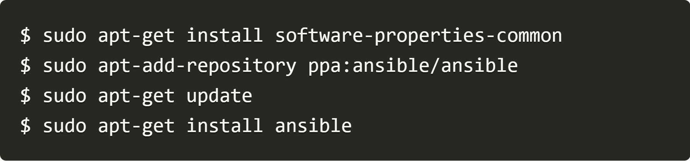
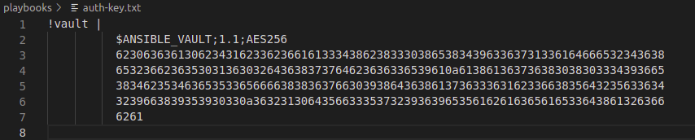
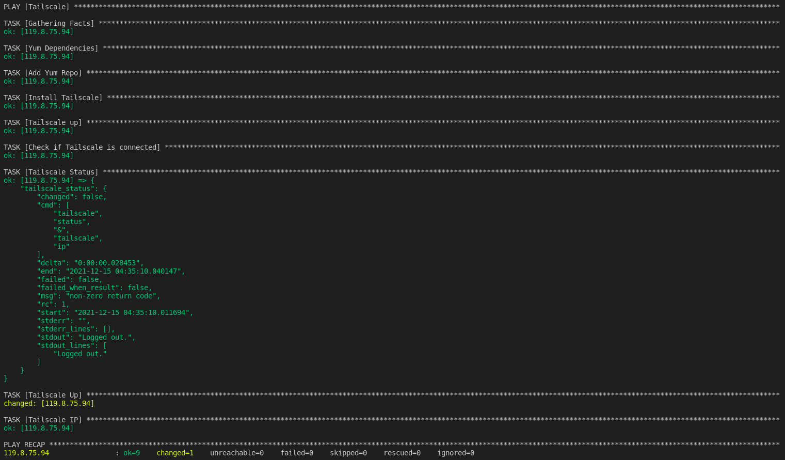
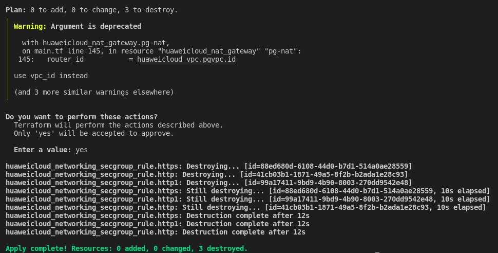
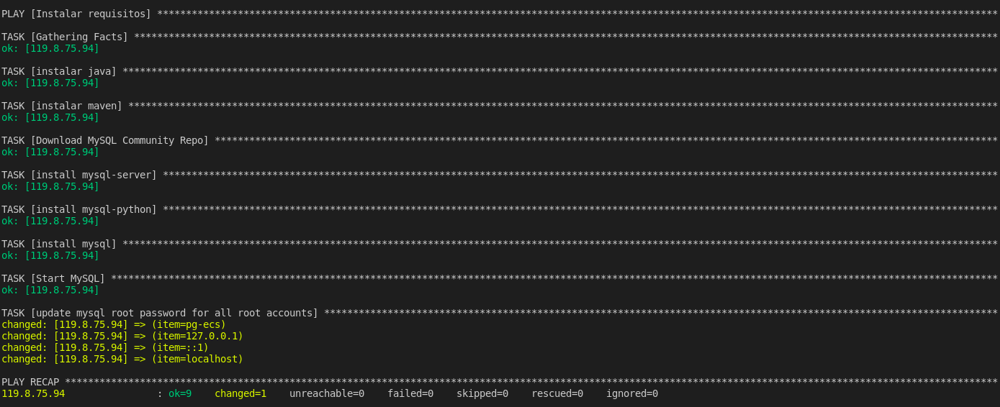

# Week 03 - ansible Assignments
Repositorio para los assignments de ansible.

# Java Application

## Prerequisites

	1. Internet connection
	2. git
	3. Terraform
	4. Huaweicloud access key & secret key available
	5. Go
	6. Ansible
	7. Logged into tailscale vpn https://tailscale.com/

## instalar huawei cloud provider
Clone repository to: $GOPATH/src/github.com/huaweicloud/terraform-provider-huaweicloud

mkdir -p $GOPATH/src/github.com/huaweicloud; cd $GOPATH/src/github.com/huaweicloud
git clone https://github.com/huaweicloud/terraform-provider-huaweicloud
Enter the provider directory and build the provider

cd $GOPATH/src/github.com/huaweicloud/terraform-provider-huaweicloud
make build

## Instalar Terraform (Ubuntu)
curl -fsSL https://apt.releases.hashicorp.com/gpg | sudo apt-key add -

sudo apt-add-repository "deb [arch=$(dpkg --print-architecture)] https://apt.releases.hashicorp.com $(lsb_release -cs) main"

sudo apt install terraform

Terraform version (Check the installation)

## Instalar Ansible (Ubuntu)



## Tareas Realizadas
```
	1. repo original https://gitlab.com/equipo-devops/bootcamps/semperti-bootcamp clonado y pusheado a https://gitlab.com/equipo-devops/bootcamps/sre-bootcamp-pablo-20211115	
	2. Branch checkout terraform
	3. Terraform instalado
	4. Descargar huaweicloud provider
	5. Main.tf y Versions.tf creados
	9. Ansible instalado 
	10. playbooks creados en carpeta playbooks dentro del repo
	11. inventory.yml y ansible.cfg creados para que el inventario personalizado sea usado por defecto
	12. con ansible-vault encriptamos la password del root de la vm y lo pongo encriptado en el inventory
	13. creado .sh para borrar security group rules, con el fin de que la vm se conecte solo por vpn
	14. readme.MD modificado y repo pusheado para revision
```
## Comandos ejecutados para ansible assignment

	- git@gitlab.com:equipo-devops/bootcamps/sre-bootcamp-pablo-20211115.git
	- git checkout ansible
	- git pull
	- cd playbooks
	- ansible-vault encrypt_string "Pgallo123" > auth-key.txt
 
	(la password de ansible-vault es pgall123)
	- ansible-playbook tailscale.yml --ask-vault-pass

	- cd ..
	- bash sg-delete.sh
	- terraform apply -var="ak=LVAINUC7AJEEHXYFHSU7" -var="sk=Jm1S1sRVV4B6FXtTsgAlLBZ6c0SgVed46niy5RXm"

	- cd playbooks
	- ansible-playbook dependencies.yml --ask-vault-pass


## Comandos ejecutados

	git@gitlab.com:equipo-devops/bootcamps/sre-bootcamp-pablo-20211115.git
	git checkout terraform
	git pull
	terraform init

	terraform plan -var="ak={access_key}" -var="sk={secret_key}"

	terraform apply -var="ak={access_key}" -var="sk={secret_key}"

	terraform destroy -var="ak={access_key}" -var="sk={secret_key}" (optional)


## Inconvenientes encontrados

	1. Algunos comandos varian ligeramente con los acostumbrados
	2. Interfa de Gitlab resulta poco intuitiva de momento
	3. Terraform EIP attachment & SG configuration

## Instrucciones para correr esta aplicación

	1. Configurar la conexión de la base de datos desde Code/src/main/resources/application.properties
	2. Ubicate en la carpeta del código y ejecutá "mvn spring-boot:run".
	3. Revisá la siguiente dirección http://localhost:8080
	4. [Opcional] Por defecto, la aplicación almacena los PDFs en el directorio <User_home>/upload. Si querés cambiar este directorio, podés utilizar la propiedad -Dupload-dir=<path>.
	5. [Opcional] Los PDFs predefinidos pueden encontrarse en la carpeta PDF. Si querés ver los PDFs, tenés que copiar los contenidos de esta carpeta a lo definido en el paso anterior.

## Datos de autenticación

	El sistema viene con 4 cuentas pre-definidas:
		1. publishers:
			- username: publisher1 / password: publisher1
			- username: publisher2 / password: publisher2
		2. public users:
			- username: user1 / password: user1
			- username: user2 / password: user2
            
# Contact

Cualquier duda o consulta, ubicanos en [Slack](https://semperti.slack.com).
